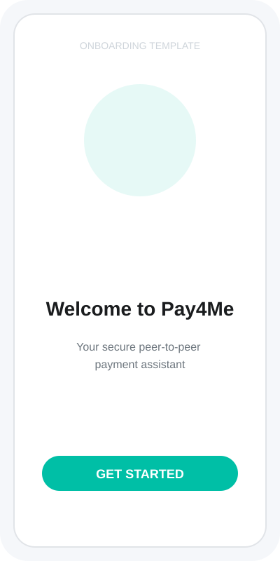
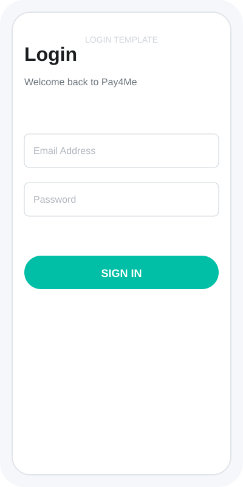
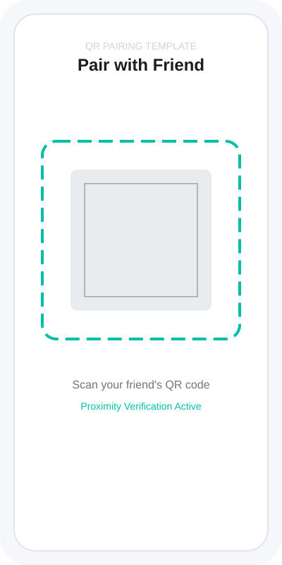
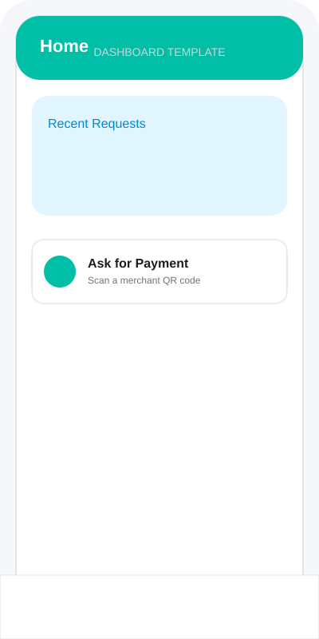
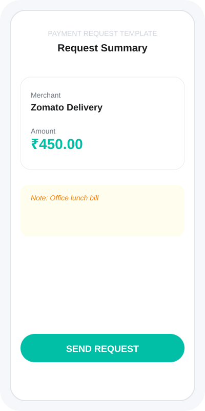
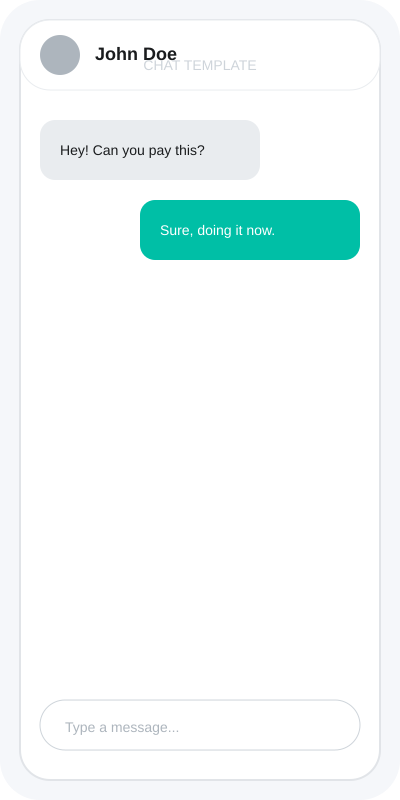

# Pay4Me 💸

**Pay4Me** is a secure, real-time Android application designed to simplify shared payments and peer-to-peer transaction coordination using UPI QR codes.

## 🚀 Key Features

- **Secure Physical Pairing:** Connect with friends using dual-proximity verification. Pairing requires both **GPS Location** and **Bluetooth BLE** confirmation to ensure you are physically standing next to each other. Remote pairing via screenshots or photos is strictly blocked.
- **UPI QR Forwarding:** Scan any UPI QR code and instantly forward it to a paired friend for payment.
- **Transaction Localization:** Automatically captures GPS coordinates during payment requests. Friends can view the request location on a map to verify authenticity.
- **Real-time Chat:** Built-in messaging system for every payment request to clarify details and share confirmation.
- **Two-Sided Confirmation:** Transparent payment tracking where both the requester and the payer must confirm the transaction.
- **SMS Alert Integration:** Optional SMS notifications for new payment requests (requires Blaze plan backend).
- **Help & Support:** Built-in searchable FAQ and help center to guide users through pairing, payments, and security features.
- **Anti-Fraud Protections:** 
  - **Screen Security:** Screenshots and screen recordings are disabled on sensitive payment and pairing screens.
  - **Lock Screen Privacy:** Transaction details are hidden from the device lock screen.
  - **Device Fingerprinting:** Records device model and ID for every request to detect unauthorized account usage.
  - **Anti-Spoofing:** Blocks mock location (Fake GPS) apps during pairing and payment requests.
  - **Account Control:** Secure profile management including verified email/phone updates and permanent account deletion options.
- **Robust Security Flow:** Mandatory sequential verification (Email → Phone OTP) ensures every account is authentic before app access is granted.
- **Adaptive Authentication:** Supports Biometrics (Fingerprint/Face) with a seamless fallback to PIN, Pattern, or Password for older devices.

## 📱 Screenshots

| Onboarding | Login | QR Pairing |
|:---:|:---:|:---:|
|  |  |  |

| Dashboard | Payment Request | Chat |
|:---:|:---:|:---:|
|  |  |  |

*(Note: Replace these template SVGs in the `art/` folder with actual screenshots to update the visual guide.)*

## 📥 Download APK

You can download the latest stable version of the Pay4Me APK from the Releases section:

[**Download Pay4Me v1.0.8 APK**](https://github.com/kirubas/pay4me/releases/latest)

### Installation Steps:
1. Download the `.apk` file.
2. If prompted, allow "Install from Unknown Sources" in your Android settings.
3. Open the file and tap **Install**.
4. Open the app and verify your email and phone number to start pairing!

## 🛠 Tech Stack

- **UI:** XML Layouts, Material Design 3, Lottie Animations, Shimmer.
- **Backend:** Firebase (Authentication, Cloud Firestore, Realtime Database).
- **Proximity:** GPS Location + Bluetooth Low Energy (BLE) scanning.
- **Images:** Cloudinary Android SDK.
- **Utilities:** Google ZXing (QR), Glide (Image Loading), WorkManager.
- **Logging:** Timber.

---

## 👨‍💻 For Developers

If you are looking to build the project from source or contribute, please refer to the **[DEVELOPER.md](./README_DEV.md)** file for detailed setup instructions.

## 📄 License

This project is licensed under the MIT License.
